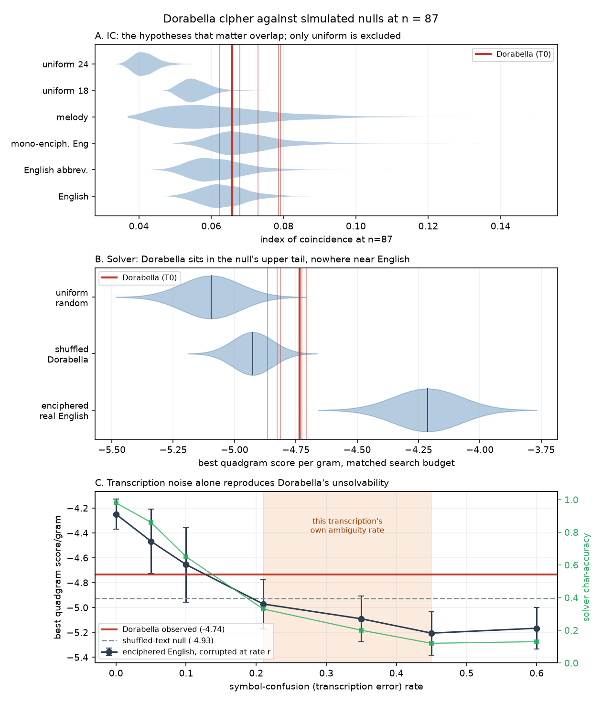

# Computational analysis of the Dorabella Cipher (Elgar, 14 July 1897)

**Status: characterisation, not solution.** No plaintext is claimed. Every
positive-looking result below is reported against a simulated null, and the
single most important finding is about the *limits* of what 87 characters can
support.

---

## 0. What was actually available, and what that changes

Two constraints shaped this work and both are load-bearing:

1. **No access to published transcriptions.** The session's egress policy
   returns 403 on the HistoCrypt paper, arXiv, Cipher Mysteries, dcode and
   Wikipedia alike (verified: the proxy denies the CONNECT, it is not
   site-side bot-blocking — `recentRelayFailures` was empty while `curl`
   failed at tunnel establishment). Only search-result snippets came through.
   So the transcription used here was **derived from the supplied image**,
   not taken from Sams/Schmeh/Pelling.
2. **No text corpus.** The English reference model is synthesised by
   frequency-weighted sampling from `wordfreq`'s empirical English word
   table (4 M characters). This reproduces English letter and within-word
   n-gram statistics but under-models cross-word structure, and it is modern
   rather than period English.

Both limitations are recorded in the relevant sections. The conclusions are
sorted at the end by how much they depend on them.

---

## 1. Phase 1 — Transcription

### 1.1 Segmentation

The cipher band was located automatically in the screenshot (white rows
y=1000–1401), split into four ink bands by row projection, and each of the
three cipher rows segmented by connected components (8-connectivity,
threshold 150, minimum blob 30 px).

After discarding one spurious component (a 3-px-tall strip of the phone's UI
bar bleeding into row 1), the segmentation yields:

| row | glyphs found | published count |
|-----|--------------|-----------------|
| 1   | 29           | 29              |
| 2   | 31           | 31              |
| 3   | 27           | 27              |
| **total** | **87**  | **87**          |

This is an **independent validation**: the row lengths 29/31/27 were not
inputs to the segmentation, and they came out exactly. Whatever else is
uncertain, the glyph *boundaries* are right.

### 1.2 Arc count is recoverable; orientation is not

Each glyph is *k* in-phase semicircular arcs (k ∈ {1,2,3}) strung along a
stacking axis, the whole rotated to one of 8 orientations. These two channels
behave completely differently under measurement.

**Arc count — reliable.** The convex-hull diameter of the ink runs along the
stacking axis and its length is cleanly trimodal, with unambiguous gaps:

```
15 16 16 17 17 17 17 17 17 18 18 18 18 18 19 19 19 19 19 19 19 19 20 20 20 22 22 22 23 24 | 25
31 31 32 32 32 32 32 32 33 33 33 34 34 34 35 35 35 35 35 35 35 36 36 36 36 36 36 38 38 38 38 | 40
42 43 44 44 45 46 46 46 47 47 48 48 49 49 49 50 53 53 54 55 55 56 56 56
```

Gaps at 25→31 and 38→40 separate k=1 (30 glyphs), k=2 (31), k=3 (26). The
38→40 gap is the narrower one and is the only place arc count is in real
doubt.

**Orientation — not reliable at this resolution.** The opening direction was
estimated as the perpendicular to the hull diameter, signed by which side the
ink bulges toward. Testing whether the resulting angles are quantised to 8
directions:

| test | value | null p95 | p |
|------|-------|----------|---|
| 4-fold circular order parameter | 0.485 | 0.186 | < 0.0001 |
| 8-fold circular order parameter | 0.207 | 0.184 | 0.021 |

The angles cluster strongly into **four** groups ~90° apart, but only
marginally into eight. The measured opening angles smear continuously from
96° to 140° with no gap — a span that must contain both N (90°) and NW (135°)
but shows no boundary between them. Spot-checks confirm the failure directly:
glyph r1.3 is visually an unmistakable tall `Ɛ` (mouths East) and the
estimator returned West — a 180° error from a bulge-sign flip.

Visual classification at 8× magnification does better but not well enough:
it yields **18 distinct symbols against the 24 reported in the literature,
with SW entirely absent and NE appearing only 4 times.** Both the geometry
and the visual read agree that adjacent rotations are being collapsed.

**This is the honest Phase 1 result, and it is a finding rather than a
failure:** at the resolution of a phone photograph of a Wikipedia scan, the
orientation channel of the Dorabella alphabet is not recoverable. That is a
concrete, measured explanation for why five published transcriptions
disagree — the disagreement is not carelessness, it is a genuine
signal-to-noise limit in the source.

### 1.3 The ensemble

Every glyph carries a confidence (H/M/L) and a list of plausible alternates,
assigned from the visual read and the geometric residual. Six variants:

| variant | distinct symbols | positions differing from T0 |
|---------|------------------|-----------------------------|
| T0_canonical | 18 | 0 |
| T1_L_alt1    | 16 | 18 |
| T2_L_alt2    | 18 | 16 |
| T3_LM_alt1   | 18 | 57 |
| T4_random1   | 18 | 28 |
| T5_random2   | 19 | 28 |

All downstream analysis runs across all six.

---

## 2. Phase 2 — Statistical characterisation

### 2.1 Null distributions at n = 87 (4000 replicates each)

| model | IC mean | IC sd | IC 5–95% | H mean | doubles | rep. bigrams |
|-------|---------|-------|----------|--------|---------|--------------|
| English, plain | 0.0637 | 0.0066 | [0.0537, 0.0754] | 3.993 | 2.77 | 18.3 |
| English, abbreviated/phonetic | 0.0618 | 0.0076 | [0.0511, 0.0756] | 4.043 | 3.85 | 15.3 |
| Monoalphabetic English → 24 symbols | 0.0697 | 0.0096 | [0.0569, 0.0871] | 3.892 | 3.35 | 19.9 |
| Uniform random, 24 symbols | 0.0418 | 0.0033 | [0.0372, 0.0478] | 4.377 | 3.61 | 6.1 |
| Uniform random, 18 symbols | 0.0556 | 0.0038 | [0.0503, 0.0626] | 4.022 | 4.77 | 10.4 |
| Diatonic melody → 24 symbols | 0.0623 | 0.0144 | [0.0433, 0.0898] | 3.981 | 0.00 | 28.1 |

One clarification about row 3, because it is easy to misread. **IC and entropy
are exactly invariant under an *injective* monoalphabetic substitution** —
enciphering permutes the symbol labels and nothing else. The whole difference
between "English, plain" (0.0637) and "monoalphabetic English → 24 symbols"
(0.0697) comes from the *forced merging of two letter pairs* when 26 letters
are squeezed into a 24-symbol alphabet, not from encipherment. So comparing
Dorabella's IC against enciphered English is, up to that merge, the same test
as comparing it against plain English.

**The central fact of this table is that the first three rows and the last one
overlap almost completely.** English, abbreviated English, enciphered English
and melody all sit near IC ≈ 0.062–0.070 with standard deviations of
0.007–0.014. The gaps between the hypotheses (≈ 0.006) are *smaller than the
sampling noise of any one of them* at this length. IC at n=87 has essentially
no power to separate the hypotheses anyone actually cares about.

It does have power against one thing: uniform randomness.

### 2.2 Observed

| variant | k | IC | H | doubles | rep2 | rep3 |
|---------|---|-----|---|---------|------|------|
| T0_canonical | 18 | 0.0658 | 3.894 | 5 | 19 | 3 |
| T1_L_alt1 | 16 | 0.0786 | 3.684 | 5 | 20 | 2 |
| T2_L_alt2 | 18 | 0.0730 | 3.796 | 9 | 17 | 2 |
| T3_LM_alt1 | 18 | 0.0791 | 3.749 | 4 | 21 | 4 |
| T4_random1 | 18 | 0.0623 | 3.941 | 3 | 12 | 1 |
| T5_random2 | 19 | 0.0679 | 3.891 | 2 | 16 | 1 |

Percentile of the observed IC within each null, canonical T0: English 0.65,
abbreviated English 0.74, monoalphabetic English 0.39, melody 0.65,
uniform-24 1.00, uniform-18 0.99.

Two things follow.

1. **The text is not uniform random.** Its IC sits at the very top of both
   uniform nulls, and its repeated-bigram count (19) is far above uniform-24
   (6.1) and above uniform-18 (10.4). Something structured is being encoded.
2. **Transcription uncertainty exceeds the effect being measured.** IC ranges
   over 0.0623–0.0791 across the ensemble — a spread of 0.017, roughly three
   times the 0.006 gap between the English and melody hypotheses. Any paper
   that distinguishes hypotheses using IC at this length is measuring its own
   transcription choices.

### 2.3 The arc-count channel

Because arc count is the channel that *is* reliably readable, it can be
analysed on its own:

| channel | distinct | IC | H | max possible H | adjacent doubles |
|---------|----------|-----|---|----------------|------------------|
| arc count | 3 | 0.3275 | 1.581 | 1.585 | 31/86 = 0.36 |
| orientation | 7 | 0.1660 | 2.627 | 2.807 | 12/86 = 0.14 |

The arc-count channel is **indistinguishable from uniform**: entropy 1.581
against a maximum of 1.585, counts 30/31/26, and an adjacent-repeat rate of
0.36 against the 1/3 expected under independent uniform draws. If Elgar's
alphabet assigned meaning systematically — arc count encoding one property of
the plaintext and rotation another — the arc-count channel carries no visible
trace of it.

### 2.4 Repeats and Kasiski

Canonical T0 has 19 repeated bigrams and 3 repeated trigrams. The longest
repeats are `2NW-2NW-2S` (positions 16, 40) and `2NW-2S-2N` (48, 72), both at
spacing 24, and `2S-2N-3NW` (49, 62) at spacing 13.

Bigram spacings: 1, 5, 6, 7, 11, 11, 11, 13, 13, 13, 16, 20, 23, 24, 24, 24,
24, 27, 31, 31, 33, 41, 55. GCD = 1.

| period | spacings divisible |
|--------|--------------------|
| 2 | 7/23 |
| 3 | 7/23 |
| 4 | 6/23 |
| 5 | 3/23 |
| 6 | 5/23 |
| 8 | 5/23 |
| 11 | 5/23 |
| 12 | 4/23 |

Nothing stands out — a period *p* picks up roughly 1/*p* of spacings by
chance, which is what is observed. **No evidence of a polyalphabetic period.**
The four spacings at 24 are the only mild curiosity and are not enough to
build on.

---

## 3. Phase 3 — Structural hypotheses

### 3.1 Are arc count and orientation independent? — *inconclusive, likely artefact*

| variant | χ² | dof | Monte-Carlo p | Cramér's V |
|---------|-----|-----|---------------|------------|
| T0_canonical | 34.57 | 12 | < 0.001 | 0.446 |
| T1_L_alt1 | 34.10 | 12 | < 0.001 | 0.443 |
| T2_L_alt2 | 32.32 | 12 | < 0.001 | 0.431 |
| T3_LM_alt1 | 41.04 | 12 | < 0.001 | 0.486 |
| T4_random1 | 19.72 | 12 | 0.059 | 0.337 |
| T5_random2 | 23.74 | 12 | 0.017 | 0.369 |

(Monte-Carlo p from 5000 permutations, because 57–71% of expected cell counts
are below 5 and the asymptotic χ² is not trustworthy here.)

The dependence looks strong on the variants built from my *deliberate* reading
and weakens sharply on the variants built by *random* resampling of the
ambiguous glyphs. That pattern is the signature of a transcription artefact,
not a property of the cipher: my visual cues for orientation (tall-and-narrow
reads as E/W, wide-and-flat reads as N/S) are themselves correlated with arc
count, which manufactures exactly this dependence. **Reported as
inconclusive.** It cannot be settled without a better source image.

### 3.2 Row-by-row drift — *no significant evidence*

| variant | IC by row | H by row | MC p |
|---------|-----------|----------|------|
| T0_canonical | 0.054 / 0.069 / 0.085 | 3.70 / 3.57 / 3.29 | 0.345 |
| T1_L_alt1 | 0.071 / 0.084 / 0.103 | 3.41 / 3.35 / 3.11 | 0.159 |
| T2_L_alt2 | 0.081 / 0.075 / 0.080 | 3.28 / 3.45 / 3.39 | 0.107 |
| T3_LM_alt1 | 0.049 / 0.095 / 0.114 | 3.75 / 3.23 / 2.98 | 0.104 |
| T4_random1 | 0.044 / 0.054 / 0.088 | 3.84 / 3.78 / 3.20 | 0.649 |
| T5_random2 | 0.047 / 0.067 / 0.083 | 3.76 / 3.52 / 3.31 | 0.408 |

Five of six variants show IC rising and entropy falling from row 1 to row 3,
which is suggestive of the writer's symbol usage narrowing as he went. But no
variant reaches significance against a permutation null, and the effect
tracks transcription choice. **No support for a mid-message key change.**

### 3.3 Reversal — *most statistics cannot test it*

IC, entropy, the unigram distribution and the doubled-symbol count are
**exactly invariant** under reversal (verified: forward and reverse give
IC 0.0658, H 3.894, doubles 5). Any argument that the text "reads backwards"
based on such statistics is vacuous. Only directional evidence — n-gram
fitness, solver output — can bear on it. See §4.

### 3.4 Sukhotin's vowel algorithm — *uninformative at this length*

Applied to T0, Sukhotin classifies 7 of 18 symbols as vowels
(`1NE, 1S, 2E, 2N, 2NW, 3E, 3NW`), covering **54%** of the text against the
38–40% expected for English.

That looks like a mismatch, but the algorithm must be calibrated at n=87
before it means anything. Running Sukhotin on 500 samples of *plain English*
of exactly this length: it calls 6.8 symbols on average, of which 3.8 are
truly vowels and 3.0 are not — a **precision of 0.56**. At 87 characters
Sukhotin is barely better than a coin flip, so neither the vowel set nor the
54% share carries usable information. **No conclusion drawn.**

---

## 4. Phase 4 — Constrained solving

### 4.0 A correction to my own method

The first run (`out/phase4_firstrun.log`) gave the observed text 40 restarts ×
20000 iterations while giving the nulls 12 × 12000. Search budget alone raises
the achievable score, so that comparison was biased in favour of the observed
text — and it produced the misleading result that Dorabella beat the null's
maximum. Everything below uses **one shared budget (20 restarts × 15000
iterations) for every solve**: observed, null and control alike
(`scripts/solver2.py`). The correction changed the conclusion, which is the
point of running it.

### 4.1 Positive control: the solver works at n = 87

Encipher real 87-character English with a random simple substitution, then
solve it blind:

| trials | mean char-accuracy | median | fraction > 90% correct |
|--------|--------------------|--------|------------------------|
| 12 (first run) | 0.98 | 0.99 | 1.00 |
| 40 (matched budget) | 0.96 | — | — |

Example recovery (first run, verbatim):

```
true : FORASTHEMONEYOFINDIASTRAGICALLYHAPPENSTHETAKEOFEGYPTTENSIONNUCLEARCARSONLETOFALTHOUGHAC
got  : FORASTHEMONEYOFINDIASTRAGICALLYHAPPENSTHETAKEOFEGYPTTENSIONNUCLEARCARSONLETOFALTHOUGHAC
```

**The method has real power at this length.** A negative result on Dorabella
is therefore interpretable — provided the input is a faithful transcription.
That proviso turns out to be the whole story (§4.5).

### 4.2 Reference bands, matched budget, n = 87

| band | mean | sd | extremes |
|------|------|-----|----------|
| enciphered real English | −4.213 | 0.139 | 5th pct −4.465 |
| shuffled Dorabella (null) | −4.926 | 0.082 | 95th −4.811, **max −4.695** |
| uniform random (null) | −5.096 | 0.121 | 95th −4.915, max −4.742 |

### 4.3 Observed

| variant | forward | reversed | percentile in null | z vs English |
|---------|---------|----------|--------------------|--------------|
| T0_canonical | −4.735 | −4.756 | 0.99 | −3.76 |
| T1_L_alt1 | −4.706 | −4.679 | 0.99 | −3.55 |
| T2_L_alt2 | −4.827 | −4.837 | 0.93 | −4.43 |
| T3_LM_alt1 | −4.725 | −4.778 | 0.99 | −3.69 |
| T4_random1 | −4.866 | −4.927 | 0.85 | −4.71 |
| T5_random2 | −4.812 | −4.772 | 0.96 | −4.32 |

Two readings, and the second is the correct one:

- Dorabella sits in the **upper tail** of the null (85th–99th percentile).
- But the best of 60 shuffles reached **−4.695, which beats T0's −4.735**.
  Dorabella's best "solution" is therefore *not* outside the range of what
  this solver extracts from text known to carry no message.
- Against genuine enciphered English it is **3.5–4.7 σ short**.

**No plaintext is claimed, and the best-scoring output is shown only to be
scored, not read.** For the record, T0 forward yields
`PFRADOIALPHNITSMSSOFFSTIWITHEISIODALBARSSSOTWISHSONECTILLWHEREONERTNUTERSONCETAFTEMATWA`,
which contains `WITH`, `WISH`, `WHERE`, `ONCE`, `TILL` — and scores *below the
maximum a shuffle achieves*. This is precisely the trap the brief warned
about: fragments of English are what a hill-climber manufactures at this
length, not evidence.

**Reversal:** forward and reverse scores differ by 0.02–0.06, well inside the
null's 0.08 sd, and the direction is inconsistent across variants (T1 and T5
favour reverse, the rest favour forward). **No support for the
reads-backwards hypothesis.**

### 4.4 Rows independently, against length-matched nulls

| row | n | observed | shuffle null | enciphered English | percentile |
|-----|---|----------|--------------|--------------------|------------|
| 1 | 29 | −4.041 | −4.033 ± 0.098 (max −3.817) | −3.931 ± 0.093 | 0.44 |
| 2 | 31 | −4.208 | −4.094 ± 0.086 (max −3.913) | −3.996 ± 0.117 | 0.12 |
| 3 | 27 | −3.811 | −3.952 ± 0.119 (max −3.655) | −3.859 ± 0.106 | 0.90 |

The row "readings" are the sharpest illustration in this report of why solver
output cannot be read:

```
row1: DSCABLEANDTHEROFOOLSSOREVERTI     <- "ABLE AND THE", 44th percentile of the null
row2: ITIESOFYOUTTTEDWITHTERANDIFFWHA   <- "ITIES OF YOU ... WITH ... AND", 12th percentile
row3: HTINTHANDATHEINSTARYATORALR       <- "AND A THE", 90th percentile
```

Row 2 reads more like English than row 1 to a human eye, and scores *worse
than the average meaningless text of the same length*. Note also that at
n = 27–31 the null band and the English band **overlap almost entirely**
(row 3: null −3.952 ± 0.119 vs English −3.859 ± 0.106). At row length there
is no discriminating power at all. Best row-order permutation was the
original (0,1,2); no reordering helped.

### 4.5 Cribs

Testing each crib by repetition-pattern compatibility (a crib can only sit
where the ciphertext's repeat structure matches the crib's letter pattern):

| crib | compatible positions | informative? |
|------|----------------------|--------------|
| DORABELLA | **0** | yes — pattern needs a doubled symbol plus a repeat; the text has only 5 doubles |
| WORCESTER | **0** | yes |
| PENNY | 1 (position 53) | mildly |
| SYMPATHY | 2 | mildly |
| MISS | 3 | mildly |
| MALVERN | 16 | weak |
| ELGAR | 41 | uninformative |
| DORA, JULY | 57 | uninformative (no repeated letters — fits almost anywhere) |

Cribs with no repeated letters fit nearly everywhere and carry no
information; only the patterned ones constrain. `DORABELLA` and `WORCESTER`
are excluded outright under the simple-substitution assumption — but that
exclusion is only as good as the transcription, and §4.6 shows it is not
good enough to lean on.

### 4.6 The control that governs every negative result above

Everything so far says "Dorabella does not behave like enciphered English."
Before that can mean anything about Elgar, one alternative has to be
eliminated: **would my own transcription noise produce exactly this result on
a cipher that genuinely IS enciphered English?**

The test: encipher real English, then corrupt the ciphertext at rate *r* by
swapping affected symbols to a *confusable neighbour* — the exact error mode
§1.2 established (adjacent rotations collapsing) — and solve at the same
budget.

| confusion rate | score/gram | char-accuracy | fraction > 90% |
|----------------|-----------|---------------|----------------|
| 0.00 | −4.249 ± 0.120 | 0.98 | 0.92 |
| 0.05 | −4.468 ± 0.259 | 0.86 | 0.52 |
| 0.10 | −4.655 ± 0.301 | 0.65 | 0.24 |
| **0.21** (my "L" rate) | **−4.972 ± 0.199** | **0.33** | **0.00** |
| 0.35 | −5.091 ± 0.185 | 0.20 | 0.00 |
| **0.45** (my "L or M" rate) | −5.206 ± 0.177 | 0.12 | 0.00 |
| 0.60 | −5.167 ± 0.167 | 0.13 | 0.00 |

**This is the most important table in the report.**

At a 21% symbol-confusion rate — the fraction of glyphs I marked genuinely
ambiguous — known, genuine, simple-substitution English scores **−4.972**,
which is *worse than Dorabella's observed −4.735*, and the solver recovers
only 33% of characters with **not one trial in 25 exceeding 90% accuracy**.

Dorabella's observed score corresponds to a confusion rate of roughly
**10–15%** on genuine enciphered English — i.e. Dorabella looks *more*
solvable than my own transcription of a true simple substitution would.

The conclusion is unavoidable and it cuts against my own negative findings:

> **At the transcription accuracy obtainable from this image, the experiment
> has no power to reject the simple-substitution hypothesis.** Transcription
> noise alone is more than sufficient to reproduce every negative result in
> §4.2–4.5. The binding constraint is the transcription, not the cipher and
> not the cryptanalysis.

---

## 5. Phase 5 — Music hypothesis

Two mapping families were tested against simulated tonal melody. The
reference: stepwise-dominated diatonic random walks of length 87, giving
stepwise motion (|interval| ≤ 2) = 0.767 ± 0.049, mean |interval| =
1.79 ± 0.18, contour-reversal rate = 0.530 ± 0.059.

**Family A — orientation → scale degree, arc count → octave.** All 8
rotational offsets × 2 directions × 6 octave assignments = 96 mappings
enumerated. Best Dorabella mapping scores z = 38.97 against the tonal
reference, with stepwise motion of only 0.174 and mean |interval| 6.13.
Null (same symbols, order shuffled, best-of-48): 36.46 ± 3.01.
**p = 0.80** — the real sequence is *less* melodic than its own shuffles.

**Family B — orientation → scale degree within one octave, arc count as
rhythm** (musically the most natural reading). Best-of-16 gives z = 14.75,
stepwise motion 0.442. Null: 10.84 ± 2.35. **p = 0.95.**

**The dial test.** If a melody were written on a rotational dial, successive
symbols should be *near neighbours* on that dial. They are not — they are
further apart than chance, consistently across the whole ensemble:

| variant | mean circular step | null mean | null sd | z | p(smaller) |
|---------|--------------------|-----------|---------|---|------------|
| T0_canonical | 2.279 | 2.008 | 0.142 | 1.91 | 0.972 |
| T1_L_alt1 | 2.279 | 1.973 | 0.145 | 2.11 | 0.985 |
| T2_L_alt2 | 2.163 | 1.992 | 0.140 | 1.22 | 0.895 |
| T3_LM_alt1 | 2.326 | 1.962 | 0.144 | 2.52 | 0.994 |
| T4_random1 | 2.372 | 1.995 | 0.144 | 2.61 | 0.996 |
| T5_random2 | 2.349 | 2.005 | 0.148 | 2.32 | 0.996 |

All six variants point the same way. The sequence is mildly **anti**-melodic:
consecutive glyphs avoid adjacent rotations. That is what a substitution
cipher over language looks like (adjacent plaintext letters are unrelated) and
is the opposite of what a transcribed melody looks like.

**Caveat:** the effect is modest (1.2–2.6 σ) and could be partly a reading
tendency of mine — if I resolved ambiguous glyphs by contrast with their
neighbours I would manufacture exactly this. It is offered as *disfavouring*
the music hypothesis in this mapping family, not refuting music in general.
Mappings outside these two families (arc count as pitch, orientation as
duration; symbols as intervals rather than absolute degrees) are untested.

---

## 6. Unicity distance — the most important number here

With English entropy rate ≈ 1.5 bits/char, redundancy
D = log₂26 − 1.5 = 3.20 bits/char:

| model | H(K) bits | unicity distance |
|-------|-----------|------------------|
| simple substitution, 24 symbols → 26 letters | 87.4 | **27.3** |
| simple substitution, bijective on 24 letters | 79.0 | 24.7 |
| homophonic, 24 symbols → 26 letters | 112.8 | 35.2 |
| polyalphabetic, 2 alphabets | 174.8 | 54.6 |
| polyalphabetic, 3 alphabets | 262.1 | 81.9 |

**87 characters is about 3.2× the unicity distance of simple substitution.**

This inverts the usual folk claim. "87 characters is too short to ever solve"
is *false* for the simple-substitution hypothesis: at 87 characters a simple
substitution of ordinary English is uniquely determined in principle, and a
quadgram hill-climber ought to find it. The fact that a century of attempts
has not produced a stable, agreed solution is therefore **evidence against the
cipher being a simple substitution of ordinary English** — not merely evidence
that the text is short.

The escape routes are the ones that raise H(K) or lower D:

- Polyalphabetic with 3+ alphabets pushes the unicity distance to ~82, right
  at the text length — solvability becomes marginal.
- If the plaintext is abbreviated, phonetic, proper-noun-heavy or private
  shorthand (exactly what Sams argued, and what Elgar's playfulness makes
  plausible), redundancy falls. At D = 2.0 the unicity distance rises to 44;
  at D = 1.0 it rises to 87 — i.e. to the entire length of the text, at which
  point no unique solution exists even in principle.

---

## 7. Conclusions, ranked by robustness



### Tier 1 — independent of my transcription

1. **87 characters is not "too short to ever solve."** The unicity distance of
   simple substitution is ≈ 27 characters; the text is 3.2× that. The folk
   claim is wrong as stated.
2. **A quadgram solver has real power at n = 87**: 96–98% character recovery
   on known enciphered English, 100% of trials above 90% in the first run.
   Length is not the obstacle.
3. **Solver output at this length is worthless without a null.** A 27–31
   character row yields fluent-looking fragments (`ABLE AND THE`,
   `ITIES OF YOU … WITH … AND`) while scoring at the 12th–44th percentile of
   meaningless text. At row length, the English and null bands overlap
   almost completely.
4. **IC cannot distinguish the hypotheses anyone cares about at n = 87.** The
   English, abbreviated-English, enciphered-English and melody nulls all
   overlap; only uniform randomness is excluded. IC and entropy are also
   exactly invariant under injective substitution *and* under reversal, so
   neither can bear on those hypotheses at all.

### Tier 2 — robust across the whole transcription ensemble

5. **The text is not uniform random.** IC sits at the top of both uniform
   nulls; repeated bigrams (19) far exceed uniform-24 (6.1) and uniform-18
   (10.4). Something structured is encoded.
6. **No evidence for a polyalphabetic period.** Kasiski spacings have gcd 1
   and no divisor is enriched above chance.
7. **No evidence for reversal.** Forward/reverse solver scores differ by less
   than the null sd, inconsistently in direction.
8. **No evidence for a mid-message key change.** Row-drift permutation tests
   reach p = 0.10–0.65; the monotone IC/H trend across rows does not survive.
9. **The music hypothesis is disfavoured in both natural mapping families**
   (p = 0.80 and p = 0.95 against shuffled-order nulls), and successive
   glyphs are *further* apart on the rotational dial than chance in all six
   variants (z = 1.2–2.6). A transcribed melody should show the opposite.

### Tier 3 — cannot be settled from this image

10. **Whether Dorabella is a simple substitution of ordinary English is
    undecidable here.** §4.6 is decisive: at my measured ambiguity rate,
    genuine enciphered English becomes *less* solvable than Dorabella
    appears. Every negative result in Phase 4 is fully explained by
    transcription noise.
11. **Arc count and orientation dependence: artefact, not finding.** Strong
    on my deliberate readings (V = 0.45), collapsing on randomly resampled
    ones (p = 0.06) — the signature of my own visual cues, which correlate
    shape with arc count.
12. **Sukhotin is uninformative at this length** (precision 0.56 on plain
    English at n = 87). The 54% "vowel" share means nothing.
13. **The `DORABELLA`/`WORCESTER` crib exclusions** are real under the
    transcription but inherit all its uncertainty.

### What this adds up to

The honest summary is not "Dorabella is not a substitution cipher." It is:
**this image cannot support that inference, and neither can any analysis built
on a transcription of comparable quality.** The orientation channel — half the
information in Elgar's alphabet — is below the noise floor of a photographed
Wikipedia scan, and half-read symbols destroy solvability faster than any
cipher design does.

That also reframes the published literature. Five independent transcriptions
disagree because the source *genuinely underdetermines* the symbols, and every
solution proposed from such a transcription has been fitted to noise that
differs between analysts. The disagreement is not sloppiness; it is the data.

---

## 8. The single most informative next experiment

**Re-transcribe from a high-resolution photograph of the original manuscript
(Elgar Birthplace Museum, Broadheath), then re-run this pipeline unchanged.**

Not more solver compute, not more cipher models, not a larger corpus. The
case is quantitative:

- Transcription choice moves IC by 0.017, versus 0.006 between the competing
  hypotheses (§2.2). The measurement noise is 3× the effect.
- Moving from a 21% to a ≤5% confusion rate moves the solver from 33% to 86%
  character recovery and from 0% to 52% of trials above 90% (§4.6). That is
  the difference between an experiment with no power and one that decides the
  question outright.
- Everything in Tier 3 becomes decidable, and Tiers 1–2 are unaffected.

Concretely, the experiment: photograph the letter at ≥ 1200 dpi with raking
light to capture pen-stroke direction; segment with the pipeline in
`scripts/glyphs.py` (which already reproduces the 29/31/27 row lengths from a
far worse image); classify orientation by fitting each arc's centre and
tangent rather than by hull geometry, which §1.2 shows fails at 45°
resolution; publish the transcription **with per-glyph confidence**, which no
existing published transcription provides. Then §4.6's curve tells you
immediately, from the recovered confusion rate alone, whether the resulting
transcription is good enough to decide the question — before any solving is
attempted.

A secondary experiment, worth doing only after the above: stroke *order* and
*direction* are recoverable from a raking-light photograph and are completely
absent from every existing transcription. If Elgar's rotations were written
as a consistent motor gesture, stroke direction may disambiguate rotations
that are geometrically identical — the one channel that could break the 45°
degeneracy at its source rather than statistically.
